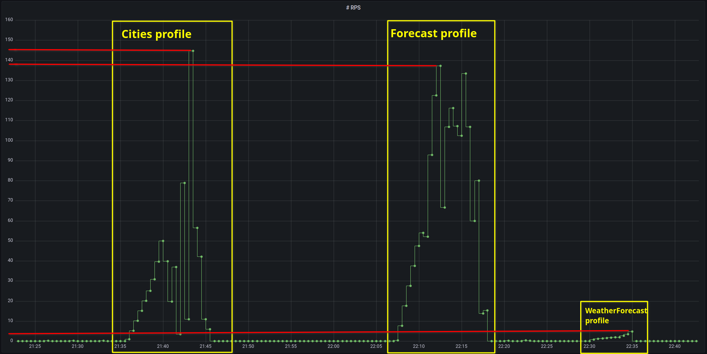

В качестве инструмента НТ (Нагрузочное Тестирование) был выбран k6. 
В разделе Подготовительные работы описаны проделанные шаги по установке и настройке k6 в связке с графаной.

<details>
  <summary>Подготовительные работы</summary>

#### Установка инструмента НТ


Установим k6, следуя официальной документации

https://k6.io/docs/get-started/installation/

На выбранной VM, с которой будет проводиться НТ, в качестве ОС установлена Ubuntu, поэтому

```console
sudo gpg -k
sudo gpg --no-default-keyring --keyring /usr/share/keyrings/k6-archive-keyring.gpg --keyserver hkp://keyserver.ubuntu.com:80 --recv-keys C5AD17C747E3415A3642D57D77C6C491D6AC1D69
echo "deb [signed-by=/usr/share/keyrings/k6-archive-keyring.gpg] https://dl.k6.io/deb stable main" | sudo tee /etc/apt/sources.list.d/k6.list
sudo apt-get update
sudo apt-get install k6
```
Результаты нагрузочного тестирования хочется также отображать в нашей "коммунальной" графане для курса по SRE.
В k6 опция output по умолчанию использует time-series базу данных Influxdb, установим её

```console
wget -q https://repos.influxdata.com/influxdata-archive_compat.key
echo '393e8779c89ac8d958f81f942f9ad7fb82a25e133faddaf92e15b16e6ac9ce4c influxdata-archive_compat.key' | sha256sum -c && cat influxdata-archive_compat.key | gpg --dearmor | sudo tee /etc/apt/trusted.gpg.d/influxdata-archive_compat.gpg > /dev/null
echo 'deb [signed-by=/etc/apt/trusted.gpg.d/influxdata-archive_compat.gpg] https://repos.influxdata.com/debian stable main' | sudo tee /etc/apt/sources.list.d/influxdata.list

sudo apt-get update && sudo apt-get install influxdb2
```

Однако, так устанавливается InfluxDB v2.7.4, когда как k6 из под коробки работает с первой мажорной версией InfluxDB.
Выберем путь установки доп. расширения для k6 для работы с InfluxDB v2 вместо откатки до первой версии.
Сначала ставим утилиту xk6, которая затем позволит установить само расширение

https://github.com/grafana/xk6#install

Репозиторий с расширением и документация по установке

https://github.com/grafana/xk6-output-influxdb


Для второй версии InfluxDB необходимо завести организацию и бакет. 
Проще всего это сделать через её веб-интерфейс, перейдя в браузере по адресу

[http://{VM_IP_ADDRESS}:8086]()


Среди готовых дашбордов для k6 с источником данных из InfluxDB v2 на сайте графаны есть 

https://grafana.com/grafana/dashboards/19431-my-k6-dashboard2/

Создаем дашборд, импортируя его ID (19431).
Заголовки частично на корейском языке, редактируем, переводя в переводчике.


```console
K6_INFLUXDB_ORGANIZATION=<insert-here-org-name> \
K6_INFLUXDB_BUCKET=<insert-here-bucket-name> \
K6_INFLUXDB_TOKEN=<insert-here-valid-token> \
./k6 run -o xk6-influxdb=http://localhost:8086 scripts/script.js
```

Файл `scripts/script.js` содержит базовый "Hello World" для k6, но его достаточно, 
чтобы увидеть первые данные в нашей графане.


#### Подготовка данных

Сделать выгрузку городов возможно проще сделать через psql или pgadmin, 
но для практики работы с k6 создадим отдельный k6-скрипт, 
который добавит все населенные пункты `data/geo_names_list.txt` через API приложения.


В `config.yaml` пропишем hostname (потребуется для передачи нужных Headers в запросах), и address - адрес тестируемого API.
Чтобы не хранить `config.yaml` явно в репозитории он помещен в .gitignore, сам файл нужно создавать из его шаблона `config.yaml.template`

Чтобы k6 мог парсить YAML конфиг, необходимо установить следующее расширение

https://github.com/szkiba/xk6-yaml

Согласно README репозитория xk6-yaml для установки запускаем
```console
xk6 build --with github.com/szkiba/xk6-yaml@latest
```
Но xk6 пересобирает бинарник k6, в котором после пересборки потеряется расширение для influx-db. 
Воспользуемся тем, что `--with` поддерживает многократный вызов и соберем единый k6

```console
xk6 build --with github.com/grafana/xk6-output-influxdb --with github.com/szkiba/xk6-yaml@latest
```

Теперь всё готово для нагрузочного тестирования нашего стенда.
</details>

### SLO/SLA

Т.к. нас нет исторических данных об использовании сервиса в предоставленном стенде, сделаем свои предположения и гипотезы.

##### SLA:
Пусть наш сервис предоставляет информации о температуре наружного воздуха для пользователей из примерно 1200 населенных пунктов.
Общее количество пользователей не может превысить 30 млн.

Также будем считать, что клиентская часть приложения не обновляет текущую погоду в фоновом режиме, 
а лишь отображает актуальные данные только по запросу (GET) от пользователя.
Условимся, что в среднем пользователь запрашивает погодные данные 3 раза за сутки.
Пиковая нагрузка в утренние часы перед выходом на работу 7-9 часов.

Добавление/обновление погодных данных инициируется отдельными сервисами вызовами POST/PUT запросами ориентировочно раз в пять минут для каждого населенного пункта.

##### SLO: 
На основании вышеизложенных предположений сделаем следующие оценки:

RPS для GET запросов равномерно распределенных в пиковые 2 часа:

30 млн/(60 сек * 60 мин * 2 часа) = 4167 rps

Для POST/PUT запросов по обновлению данных (с каждого населенного пункта поступает информация не чаще чем раз в пять минут):

1200 источников / (5 мин * 60 сек) = 4 rps

Приемлемая задержка (Latency)  < 1s

### Профили тестирования

Основная нагрузка на сервис идёт от пользователей по GET-запросам.

В API стенда имеется три endpoint'a. Для каждого из них создан отдельный скрипт для нагрузки GET-запросами.

`scripts/cities.js` - нагружает систему в течение 9 минут постепенно увеличивая нагрузку до 1000 rps.

`scripts/forecast.js` - нагружает систему в течение 9 минут постепенно увеличивая нагрузку до 1000 rps, при этом кроме получения списка прогнозов /Forecast, вызывает второй запрос /Forecast/{CityId}, т.к. вероятнее всего на стороне клиента потребуются данные с обоих запросов.

`scripts/weatherforecast.js` - нагружает систему в течение 9 минут постепенно увеличивая нагрузку до 250 rps.

### Выводы



30 * 140 = 4200

Latency удовлетворяет пример ~900 rps

1. Добавить слой кеширования в архитектуру системы
2. Узкое место в endpoint для WeatherForecast
3. Улучшить дашборды в графане

